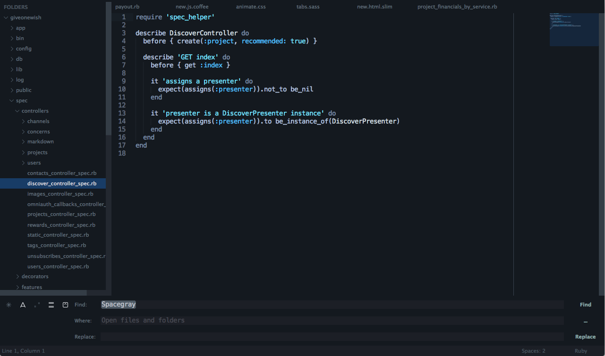

# Darkmatter

A set of custom UI themes for Sublime Text 2/3. It's all about hype and minimal.

***

### Themes

#### Darkmatter

Based on [TronLight Theme](http://colorsublime.com/theme/TronLight) and [Space Gray Theme](https://github.com/kkga/spacegray).



***

### How to Install

#### Via Package Control

The easiest way to install is using [Sublime Package Control](https://sublime.wbond.net), where Darkmatter is listed as `Theme - Darkmatter`.

1. Open Command Palette using menu item `Tools -> Command Palette...` (<kbd>⇧</kbd><kbd>⌘</kbd><kbd>P</kbd> on Mac)
2. Choose `Package Control: Install Package`
3. Find `Theme - Darkmatter` and hit <kbd>Enter</kbd>

#### Manual

You can also install the theme manually:

1. [Download the .zip](https://github.com/mpatrick/Sublime-Dark-Matter-Theme/archive/master.zip)
2. Unzip and rename the folder to `Theme - Darkmatter`
3. Copy the folder into `Packages` directory, which you can find using the menu item `Sublime Text -> Preferences -> Browse Packages...`

***

### How to Activate

Activate the UI theme and color scheme by modifying your user preferences file, which you can find using the menu item `Sublime Text -> Preferences -> Settings - User` (<kbd>⌘</kbd><kbd>,</kbd> on Mac).

You can choose whichever flavor you like, but don't forget to change *both* color scheme and UI theme so they match.

***Note: Don't forget to restart Sublime Text after activating the theme.***

#### Settings for Darkmatter

```json
{
  "theme": "Darkmatter.sublime-theme",
  "color_scheme": "Packages/Theme - Darkmatter/Darkmatter.tmTheme"
}
```

***

### Settings

#### Tab labels font size

Copy and paste one of four options in your user preferences file:

```json
  "darkmatter_tabs_font_small": true
```
```json
  "darkmatter_tabs_font_normal": true
```
```json
  "darkmatter_tabs_font_large": true
```
```json
  "darkmatter_tabs_font_xlarge": true
```

#### Tabs size

Tabs height:

```json
  "darkmatter_tabs_small": true
```
```json
  "darkmatter_tabs_normal": true
```
```json
  "darkmatter_tabs_large": true
```
```json
  "darkmatter_tabs_xlarge": true
```

Tabs width:

```json
  "darkmatter_tabs_auto_width": true
```

#### Sidebar labels font size

```json
  "darkmatter_sidebar_font_small": true
```
```json
  "darkmatter_sidebar_font_normal": true
```
```json
  "darkmatter_sidebar_font_large": true
```
```json
  "darkmatter_sidebar_font_xlarge": true
```

#### Sidebar tree rows height

```json
  "darkmatter_sidebar_tree_xsmall": true
```
```json
  "darkmatter_sidebar_tree_small": true
```
```json
  "darkmatter_sidebar_tree_normal": true
```
```json
  "darkmatter_sidebar_tree_large": true
```
```json
  "darkmatter_sidebar_tree_xlarge": true
```

***

### Special Thanks to

Creator of [TronLight Theme](http://colorsublime.com/theme/TronLight) that's unknown and to [Gadzhi Kharkharov](https://github.com/kkga) for create [Space Gray Theme](https://github.com/kkga/spacegray) that I used to start this new theme/color-scheme.
